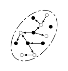

# Graphmalizer

##### Turns datasets into a graph, deal with it.

Given some datasets.

*Graphmalizer is thinking.*
Then:

A graph, same datapoints → same graph.

- [Order independent graph assembly](ordering.html)
- [Maintain graph according to some category](constraints.html)

## Parts.

We allow you to manage **datasets**. They are newline-delimited JSON files or CSV files.
Each *row* or *datapoint* is considered to be a **document**.
Every document has an **identifier** and a certain **type**.

`1:A`
`2:A`
`3:P`
`4:P`
`5:A`

You specifiy which types exist. Types can refer to **things** or **relations** between things.
To each thing we associate a **node** and to each relation a **edge**.

For instance, we can say

> type `A` ~ things of some distinguishing sort (called A) ~ 
>
> type `P` ~ relation of sort P, which runs between A × A ~ 

Documents of a type corresponding to a relation (here `3:P`,`4:P`) must specify 
a **source** and **target** identifier (referring to nodes of type `A`).

**Note**: If you leave out the *id*, we derive it from the type, source and target (details [here](encoding.html)).

For example

`1:A`
`2:A`
`P:2→5`
`P:1→2`
`5:A`

Will become

	(1)---→(2)---→(5)

Or more precisely, using the cypher-pattern language.

	(:A {id: 1}) -[:P]-> (:A {id: 2}) -[:P]-> (:A {id: 5})
