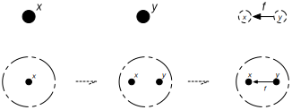
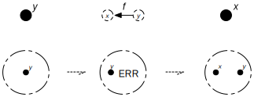
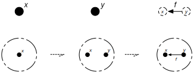
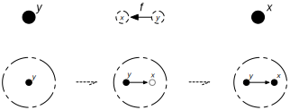
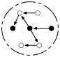
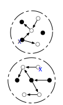
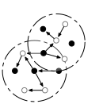

##  Building a graph and don't care.

We say a graph consists of **nodes** and **edges**,

node , edge 

Edges have a **source** and **target** node, which needs to be there before you can add the edge.

#### Ordering matters

Typically, when constructing a graph you need first need to specify the nodes before you can specify the edges.

Changing the order, for instance, adding `y` node and then the `f` edge from
`x` to `y` will fail to produce the same graph.

#### Order independent

Lets introducing *anchors*, nodes that are considered "vacant", not really there.
Now we make graph construction ordering independent:

Changing the order has no effect anymore, as in, we still get the same graph in the end.

## Joining datasets

What does this give us? We can now think of a union of datasets.

>  `foo`
>  `bar`

> 

Each dataset gives a graph and we join those into a bigger graph.

Suppose there is some overlapping identifier "*x*".

> 

Then

>  gives 
